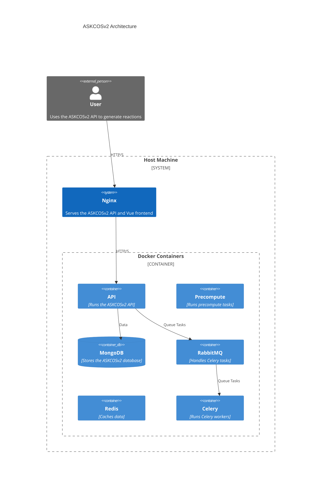

# askcos2_core Architecture

```mermaid
C4Context

title ASKCOSv2 Architecture

Person_Ext(user, "User", "Uses the ASKCOSv2 API to generate reactions")

System_Boundary(host, "Host Machine") {
    System(nginx, "Nginx", "Serves the ASKCOSv2 API and Vue frontend")

    Container_Boundary(docker, "Docker Containers") {
        Container(api, "API", "Runs the ASKCOSv2 API")
        Container(precompute, "Precompute", "Runs precompute tasks")
        ContainerDb(mongo, "MongoDB", "Stores the ASKCOSv2 database")
        Container(rabbitmq, "RabbitMQ", "Handles Celery tasks")
        Container(redis, "Redis", "Caches data")
        Container(celery, "Celery", "Runs Celery workers")
    }
}

Rel(user, nginx, "HTTP/S")
Rel(nginx, api, "HTTP/S")
Rel(api, mongo, "Data")
Rel(api, rabbitmq, "Queue Tasks")
Rel(rabbitmq, celery, "Queue Tasks")

UpdateLayoutConfig($c4ShapeInRow="3", $c4BoundaryInRow="1")
```
