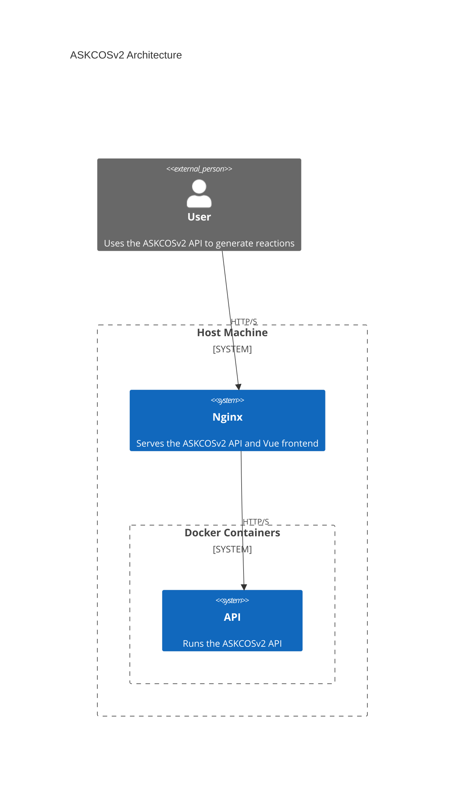

# askcos2_core Architecture

```mermaid
C4Context

title ASKCOSv2 Architecture

Person_Ext(user, "User", "Uses the ASKCOSv2 API to generate reactions")

System_Boundary(host, "Host Machine") {
    System(nginx, "Nginx", "Serves the ASKCOSv2 API and Vue frontend")
    System_Boundary(docker, "Docker Containers") {
        System(api, "API", "Runs the ASKCOSv2 API")
    }
}

Rel(user, nginx, "HTTP/S")
Rel(nginx, api, "HTTP/S")
```
