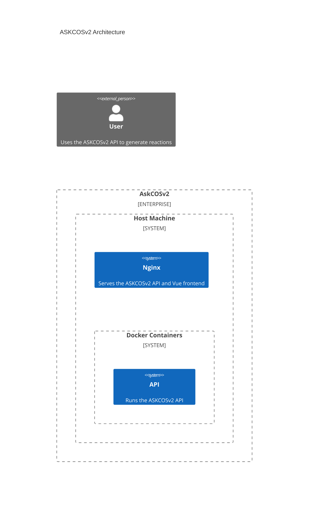

# askcos2_core Architecture

```mermaid
C4Context

title ASKCOSv2 Architecture

Person_Ext(user, "User", "Uses the ASKCOSv2 API to generate reactions")

Enterprise_Boundary(b0, "AskCOSv2") {
    System_Boundary(host, "Host Machine") {
        System(nginx, "Nginx", "Serves the ASKCOSv2 API and Vue frontend")
        System_Boundary(docker, "Docker Containers") {
            System(api, "API", "Runs the ASKCOSv2 API")
        }
    }
}
```
